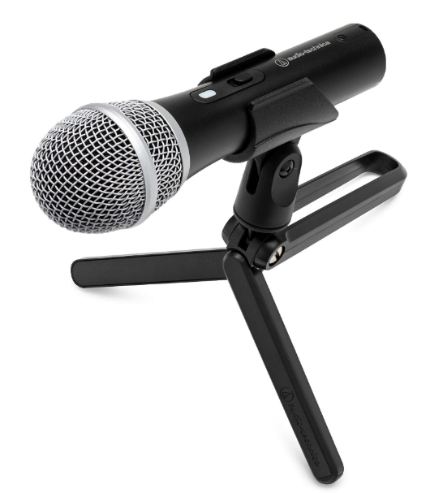
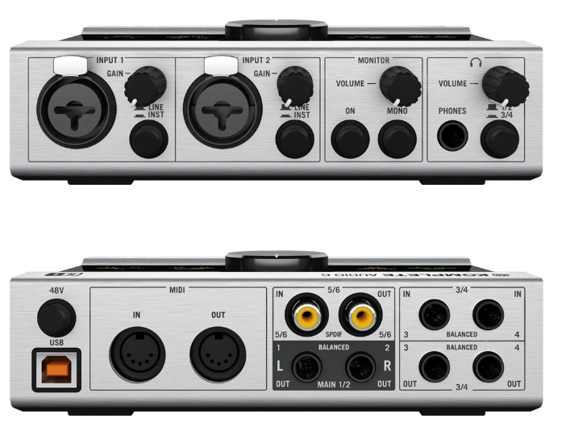
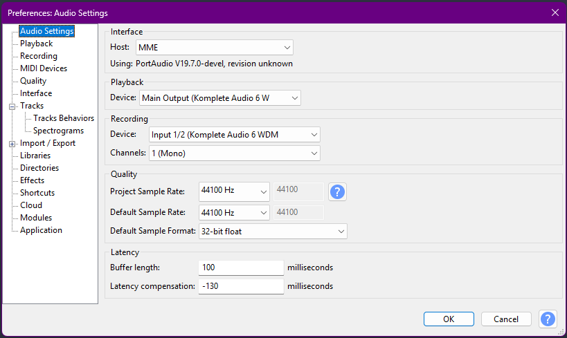
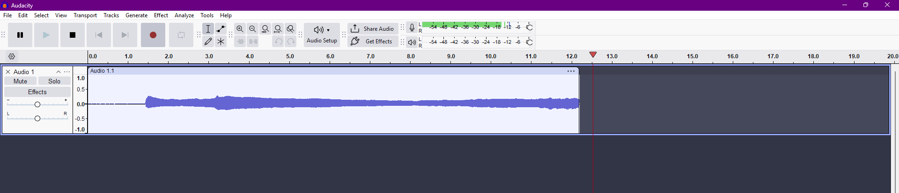

# Recording a Podcast Voice Track Using Komplete Audio 6 and Audacity

## Overview
This guide walks beginners through recording a clean spoken voice track for a podcast using a **Komplete Audio 6** and **Audacity**.  

It covers: 
- setup
- recording
- basic troubleshooting
- tips for best results  

**Audience:** New podcasters or voice-over creators with minimal technical knowledge.  
**Budget target:** Affordable, beginner-friendly setup.

---

## 1. Hardware Setup

### 1.1 Microphone
We’ll use a **dynamic USB/XLR microphone**, e.g., Audio-Technica ATR2100x-USB.  
- Connect the microphone to the Komplete Audio 6 XLR input  
- Secure the mic on a boom stand at **6–8 inches** from your mouth  
- Optional: attach a pop filter or windscreen to reduce plosives

### 1.2 Komplete Audio 6 Interface
1. Plug the Komplete Audio 6 into your computer using the supplied USB cable  
2. Turn on the interface (it’s bus-powered; lights indicate connection)  
3. Adjust the **Gain knob** on the front so the **Halo LED** peaks in the green zone when you speak at normal volume*
   
*_If your podcast might include laughter or raised voices, test gain levels accordingly._

> **Tip:** Red LED = clipping; lower the gain until the green zone is reached

### 1.3 Headphones
- Connect headphones to the **Headphone output** (_you may need a 3.5mm to 6.35mm adapter_)
- Use headphones to monitor your voice and prevent speaker feedback

---

## 2. Audacity Setup (Audacity 3.7.5)

1. Open **Audacity**.

2. Go to **Edit → Preferences → Audio Settings**  
   (On Mac: **Audacity → Preferences → Audio Settings**)

3. Under **Interface**, set:
   - **Host:**  
     - *Windows:* Select **MME** or **Windows WASAPI**  
     - *Mac:* Select **Core Audio**

4. Under **Playback**, set:
   - **Device:** **Komplete Audio 6** 
     This ensures audio plays back through the headphones connected to your Scarlett interface.

5. Under **Recording**, set:
   - **Device:** **Komplete Audio 6**  
     This tells Audacity to record from your microphone connected to the Scarlett.
   - **Channels:**  
     Select **1 (Mono)** for spoken voice recording.  
     (Podcast vocals should always be recorded in mono.)

6. Under **Quality**, confirm:
   - **Project Sample Rate:** **44100 Hz**  
   - **Default Sample Rate:** **44100 Hz**  
   - **Default Sample Format:** **32-bit float**

   These are standard settings for podcast-quality spoken audio.

8. Click **OK** to save your settings.

9. Set your recording levels:
   - Speak at normal conversation volume  
   - Watch the input meter in the top toolbar  
   - Aim for peaks around **–12 dB**  
   - Adjust using the **gain knob on the Komplete Audio 6**, not inside Audacity
  

10. Arm and test your setup:
   - Click **Record** (red circle)  
   - Speak normally  
   - Stop and playback your test recording  
   - If you hear crackling, clipping, or room noise, adjust the gain or microphone position

---

## 3. Recording a Test Track
1. Click the **Record** button in Audacity  
2. Speak naturally for **10–15 seconds**  
3. Click **Stop**  
4. Playback your recording using headphones  
5. Check for:  
   - Hiss or static  
   - Clipping/distortion  
   - Echo or excessive room noise  

---

## 4. Troubleshooting Common Issues

| Issue | Cause | Solution |
|-------|-------|---------|
| Hiss or static | Gain too high or poor USB connection | Lower Gain knob; check USB cable; move closer to mic |
| Clipping/distortion | Input too hot | Reduce Gain knob; move mic slightly farther away |
| Room echo | Untreated reflective surfaces | Hang a blanket behind mic; record in smaller room; face closet with clothes |
| Low volume | Insufficient gain | Increase Gain knob or move closer to mic |
| Latency | Buffer settings in Audacity | Close other apps; reduce monitoring latency in Audacity preferences |

---

## 5. Final Checklist Before Recording
- Microphone 6–8 inches from mouth  
- Pop filter attached (optional)  
- Komplete Audio 6 peaks in green zone  
- Room acoustics improved (blankets/pillows if needed)  
- Audacity input levels around -12 dB  
- Headphones connected for monitoring  

---

## 6. Recording Tips
- Maintain consistent distance from the mic  
- Avoid moving papers or making noise near the mic while recording  
- Speak clearly and at a steady pace  
- Save recordings in **WAV or FLAC** for editing; export as MP3 for distribution  

---

## Outcome
Following this guide, beginners can produce a clean, professional-quality spoken voice track for a podcast using a specific, real-world hardware/software setup.  

---

[Return to home page →](/README.md)
